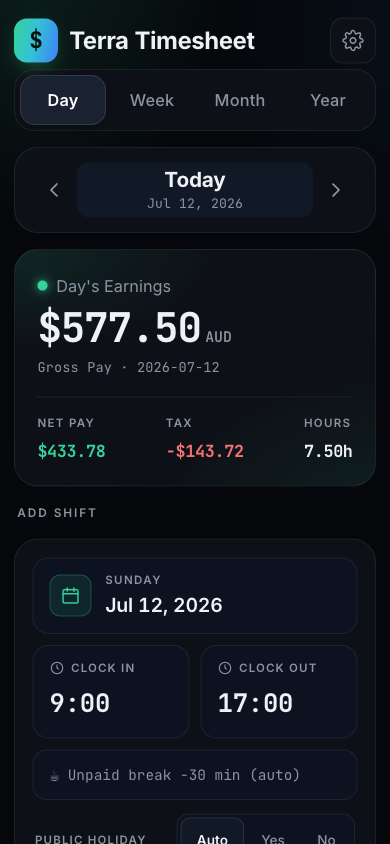
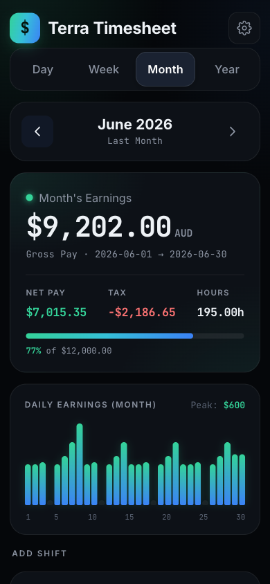
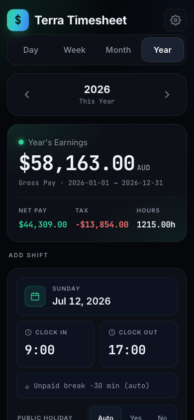
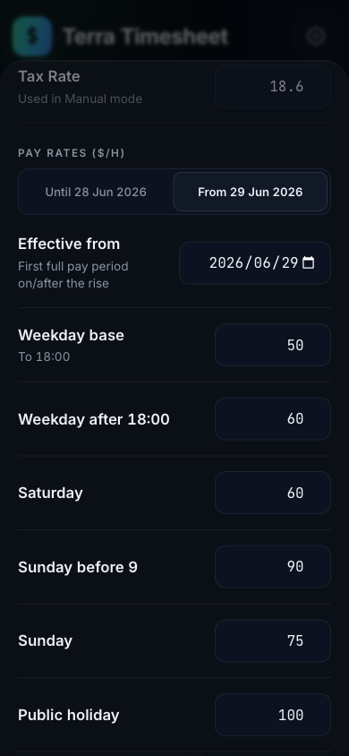
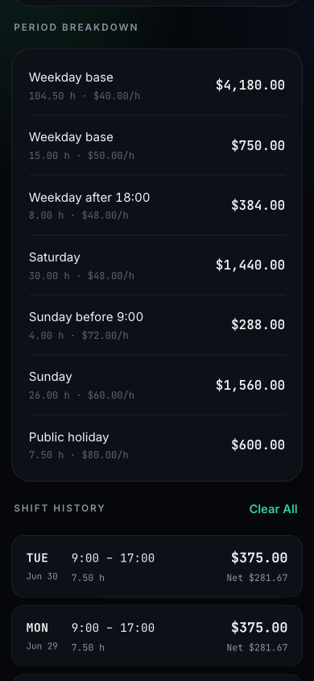

# Terra Timesheet

A single-file, offline-first **timesheet & pay calculator** for Australian shift work. Log a shift and it works out the penalty rates, the ATO tax withheld and what actually lands in your account — for the day, the week, the month and the year.

Built as a focused front-end portfolio piece: **zero dependencies, zero build step, one HTML file.** Open it in any browser and it just works.

## Live demo

**https://fmy74.github.io/terra-timesheet/** — mobile-first, so it looks best on a phone (or a narrow window). It opens empty: add a shift to see the engine run.


<p align="center">
  
  
  
</p>

<p align="center">
  
  
</p>

_Screenshots use fictional sample data — every rate, date and figure in them is made up._

## Highlights

- **Four views** — **Day**, **Week**, **Month** and **Year**, each showing gross, tax, net and hours for the period, plus a breakdown by rate and the shift history. Month adds a daily-earnings chart; Week and Month track progress against an optional goal.
- **Penalty-rate engine** — splits a shift across weekday base / after‑18:00 / Saturday / Sunday (before and from 09:00) / public holiday, removes the unpaid break from the centre of the shift, and auto-detects Victorian public holidays.
- **Automatic tax** — ATO **weekly PAYG withholding** (Scale 2, tax-free threshold claimed) computed per pay week and allocated back to each shift, so the net figure matches a real payslip. A flat manual % is available instead.
- **Effective-dated pay rates** — a pay rise starts from a date: shifts before it keep the old rates, shifts after it use the new ones, and the breakdown lists each era separately. No retro-editing of past pay.
- **Pay simulator** — "if I clock on now for 1 / 2 / 4 / 6 / 8 hours", with the *marginal* tax on those hours, not an average.
- **Swipe‑to‑delete with undo** — drag a shift card left (touch or mouse) to delete; a snackbar offers **Undo**. A visible button does the same, so it is never gesture-only.
- **Offline & private** — data lives only in `localStorage` on your device and is never transmitted. **CSV** and **JSON** export/import are manual backups.

## Engineering notes

A few things that went beyond "make it look nice":

- **Fail‑closed persistence.** Imports and saved state are fully validated into a fresh candidate object *before* they are committed; anything malformed is rejected and the existing data is left untouched, so a corrupt `localStorage` value can never brick the app.
- **Rate eras that always resolve.** Eras are sorted, de‑duplicated and the earliest one is forced to cover all earlier dates — so every shift, however old, has exactly one rate set. Blank rate fields fall back to the previous era's value, never to a silent zero.
- **Honest tax.** Withholding is a weekly, non-linear function, so it is computed on the whole pay week and split back across that week's shifts pro rata — kept unrounded internally and rounded only for display.
- **Safe undo.** Undo restores a deleted shift only if nothing has taken its place, so it can never overwrite a shift you re‑entered during the undo window.
- **Local-time dates everywhere** (never `new Date('YYYY-MM-DD')`), and "today" is re-checked when the page comes back into focus, so an app left open overnight doesn't log to yesterday.
- **Accessibility.** Semantic roles/labels, focus management in the bottom sheets, keyboard-reachable delete + undo, `prefers-reduced-motion` support, ≥44px tap targets, WCAG-checked contrast.

## Pay rules

The **calculation engine is the point, not the numbers** — no rates are baked into the code. Set your own in **Settings**: the six penalty rates, the unpaid break, your goals, and the date each pay rise takes effect.

**Overnight shifts are not supported.** A shift that crosses midnight (clock‑off ≤ clock‑on) is flagged with a *Check times* warning rather than silently miscalculated — split it into two day entries.

**Yearly maintenance (each July):** add the new financial year's ATO withholding coefficients and the next year's Victorian public-holiday dates. Both are marked in the source.

## Run it

```text
Open app.html in any modern browser.
```

No install, no server, no build. On a phone, "Add to Home Screen" gives it a full-screen app shell.

## Tech

Vanilla HTML / CSS / JavaScript · `localStorage` · Pointer Events · inline SVG chart · web fonts (Archivo + JetBrains Mono). No frameworks, no dependencies, single file.

## Project structure

```text
app.html                # the entire app
screenshots/            # README images
docs/superpowers/specs/ # the design spec the UI was built from
```

## License

[MIT](LICENSE) © 2026 Fumiya Claude
