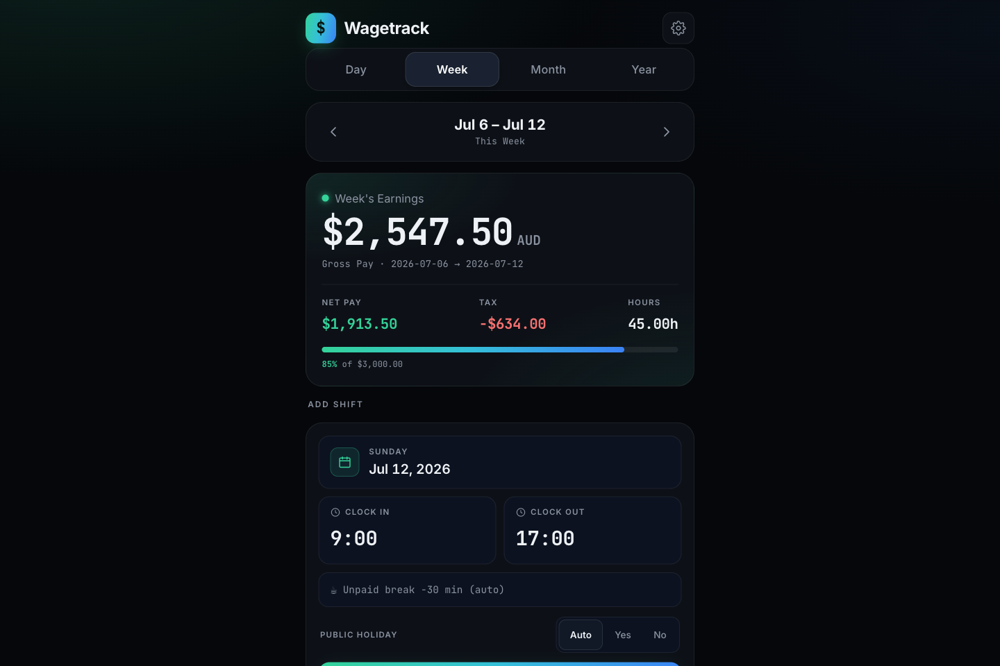
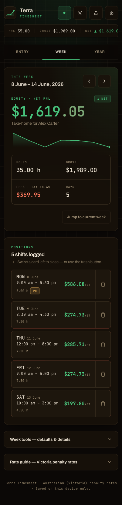
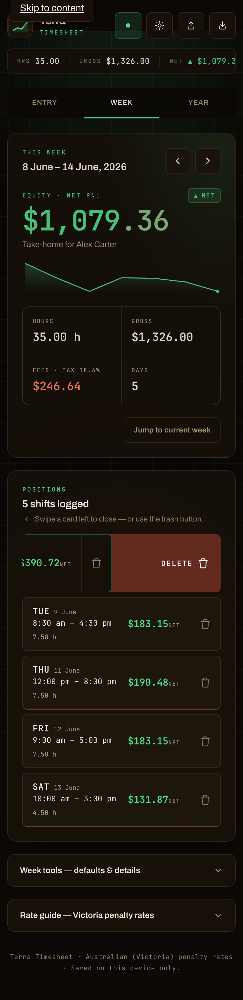
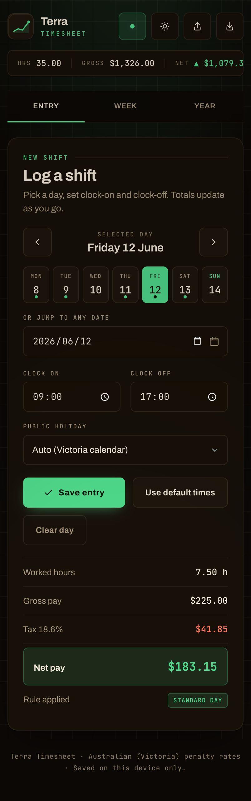

# Terra Timesheet

A single-file, offline-first **timesheet & pay calculator** styled as a crypto‑exchange trading terminal. Log your shifts, watch your "equity" (take‑home pay) update live, and swipe a shift left to delete it — with one‑tap undo.

Built as a focused front-end portfolio piece: **zero dependencies, zero build step, one HTML file.** Open it in any browser and it just works.

## Live demo

- **v1 (the app this README describes):** https://fmy74.github.io/terra-timesheet/
- **v2 (`app.html`):** https://fmy74.github.io/terra-timesheet/app.html — a mobile-first rebuild (Day / Week / Month / Year) with automatic Australian tax withholding (ATO weekly scales), effective-dated pay-rate history and CSV / JSON backup. Rates are neutral samples; set your own in the in-app Settings.



<p align="center">
  
  
  
</p>

_Screenshots use fictional sample data — the name, dates, and pay figures shown are made up._

## Highlights

- **Swipe‑to‑delete with undo** — drag a shift card left (touch *or* mouse) to reveal a red *Delete* action; release past the threshold to remove it. A bottom snackbar offers **Undo** for a few seconds. A visible trash button is the keyboard/desktop equivalent, so the action is never gesture‑only.
- **Real payroll engine** — calculates Australian (Victoria) **penalty rates**: weekday base / after‑18:00, Saturday, Sunday (before/after 09:00), and public‑holiday rates, with a 30‑minute unpaid break and an 18.6% tax estimate. Gross, tax, and net are derived per shift, rolled up per week, and summarised per month.
- **Three views** — **Entry** (log a shift for any day), **Week** (an "equity / PnL" dashboard: take‑home figure, daily‑net sparkline, hours / gross / fees / days), and **Year** (monthly totals + highlights).
- **Trading‑terminal design** — a warm, near‑black UI with a green PnL accent, a market‑stats ticker, monospace tabular numerals, and colour‑coded figures (net in green, fees/tax in red). Warm light and dark themes, both persisted.
- **Offline & private** — your timesheet data lives only in `localStorage` on your device and is never transmitted; **Export / Import** are manual JSON backups. (The page loads its web fonts from Google Fonts; your timesheet data never leaves the browser.)

## Engineering notes

A few things that went beyond "make it look nice":

- **Fail‑closed data import.** A backup file is fully validated into a fresh candidate object *before* it is committed; if anything is malformed the existing data is left untouched. Startup is hardened the same way, so a corrupt `localStorage` value can never brick the app.
- **Safe undo.** Undo only restores a deleted shift if that day is still empty, so it can never silently overwrite a shift you re‑entered during the undo window.
- **Honest validation.** A reversed or too‑short shift (clock‑off ≤ clock‑on) is flagged with a *Check times* warning instead of silently calculating $0.
- **Accessibility.** Semantic roles/labels, a focusable skip link, keyboard‑reachable delete + undo (focus moves to the Undo button on delete), `prefers-reduced-motion` support, ≥44px tap targets, and WCAG‑checked contrast in both themes.
- **60fps swipe** via Pointer Events (`touch-action: pan-y` so vertical scrolling is never hijacked), with axis locking and a rubber‑band past the threshold.

## Pay rules (Victoria‑AU style)

Illustrative **sample** rates — the calculation engine is the point, not the numbers. Edit the `RATES` object to match your own award.

| When | Rate (AUD/h) |
|---|---|
| Mon–Fri, to 18:00 | $45.00 |
| Mon–Fri, after 18:00 | $54.00 |
| Saturday | $54.00 |
| Sunday, before 09:00 | $81.00 |
| Sunday, from 09:00 | $63.00 |
| Public holiday | $90.00 |
| Unpaid break | 30 min / shift |
| Tax estimate | 18.6% |

Public‑holiday auto‑detection covers **2025–2026** (Victoria). For other years, set the *Public holiday* mode manually per day.

**Overnight shifts are not supported.** A shift that crosses midnight (clock‑off ≤ clock‑on) is treated as invalid and flagged with a *Check times* warning — split it into two day entries.

## Run it

```text
Open terra-timesheet.html in any modern browser.
```

No install, no server, no build. To try swipe‑to‑delete: log a shift (Entry → *Use default times* → *Save entry*) for a couple of days, open **Week**, then drag a card left.

## Tech

Vanilla HTML / CSS / JavaScript · `localStorage` · Pointer Events · inline SVG sparkline · web fonts (Archivo + JetBrains Mono). No frameworks, no dependencies, single file.

## Project structure

```text
terra-timesheet.html   # the entire app
screenshots/           # README images
```

## License

[MIT](LICENSE) © 2026 Fumiya Claude
